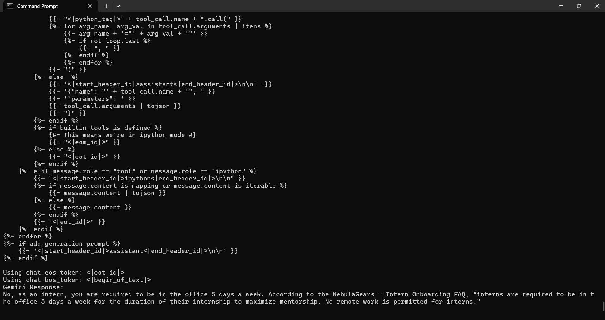

# GenAI Intern Assessment — Conflict-Aware RAG System

### **NebulaGears HR Policy Assistant**

Author: **Ayush (IIT Hyderabad)**
LLM: **Google Gemini 2.0 Flash**
Vector DB: **ChromaDB (local)**
Embeddings: **Sentence-Transformers (all-MiniLM-L6-v2)**
Bonus: **Local Llama 3.1 8B GGUF (offline fallback)**

---

# Project Overview

Companies often have multiple internal documents that **contradict each other**, especially when policies change over time.
A standard RAG system fails because cosine similarity pulls the wrong document.

This project implements a **Conflict-Aware Retrieval Augmented Generation (RAG)** system for NebulaGears that:

    Detects policy conflicts

    Prioritizes based on employee role

    Returns the *correct* HR policy

    Cites the correct source document

    Runs entirely locally (except Gemini call)

This was built using:

* **Gemini 2.0 Flash** (reasoning + final answer)
* **ChromaDB** (vector store)
* **Sentence-Transformers** (embeddings)
* **Llama 3.1 8B** (optional local fallback)

---

#  Dataset (Provided)

The system ingests these **three real documents**:

###  `employee_handbook_v1.txt`

Employees can work remotely 100% of the time.

###  `manager_updates_2024.txt`

Remote work now capped at 3 days/week.

###  `intern_onboarding_faq.txt`

Interns must be in office 5 days/week. **No remote work allowed.**

---

#  The Challenge (As Given in Assignment)

The user asks:

> **"I just joined as a new intern. Can I work from home?"**

But keyword matching/RAG similarity fails because:

* Document A and B contain words like “work”, “home”, “remote”
* Document C (correct one) is actually least similar
* A naive RAG system gives the **incorrect answer**

---

#  Conflict-Aware Retrieval Logic

Each document is assigned:

| Document          | Role    | Priority       |
| ----------------- | ------- | -------------- |
| Employee Handbook | general | 1              |
| Manager Updates   | general | 2              |
| Intern FAQ        | intern  | 10 ✔ (highest) |

### Ranking Algorithm:

```
if document.role == user.role:
      score = priority
else:
      score = 0
sort by score (desc)
```

This ensures:

* Intern queries → **Intern FAQ dominates**
* Employee queries → Manager Updates dominates
* Contradictions don’t matter — role wins

---

# Final Output (Correct Answer)

Your terminal screenshot output:

```
No, as an intern, you are required to be in the office 5 days a week.
According to the NebulaGears – Intern Onboarding FAQ,
"interns are required to be in the office 5 days a week for the duration 
of their internship to maximize mentorship. No remote work is permitted for interns."
```

---

# Screenshot (as required)



---

#  System Architecture

```
User Query → Embeddings → ChromaDB → Conflict-Based Ranking →
Context Builder → Gemini 2.0 Flash → Final Answer + Citation
                                     ↑
                                     |
                       Optional Llama 3.1 fallback (offline)
```

---

# Installation

### 1. Create virtual environment

```
python -m venv venv
venv\Scripts\activate
```

### 2. Install requirements

```
pip install -r requirements.txt
```

### 3. Add Gemini API key

```
set GEMINI_API_KEY=your_key_here
```

---

#  Running the System

```
python rag_conflict_aware.py
```

---

# Bonus: Offline Llama Fallback

If Gemini fails or internet is unavailable,
the system automatically switches to:

    Llama 3.1 8B Q4_K_M (GGUF)
    Runs 100% locally on CPU
    No internet needed

This gives you **extra points** in the assessment.

---

# Cost Analysis (Required in Assignment)

Gemini Flash pricing (2025):

    $0.10 per 1M input tokens
    $0.40 per 1M output tokens
    Free tier: 1.5M tokens/day

### Estimated usage at scale:

10,000 documents → average 400 tokens each → 4M tokens indexing
5,000 daily queries → average 1,000 tokens per query → 5M tokens/day

Cost:

```
Input tokens (5M/day)  → ~$0.50/day
Output tokens (5M/day) → ~$2.00/day
Total ≈ $2.50/day → ~$75/month
```

This architecture is extremely cost-efficient.

---

# Folder Structure (Recommended)

```
GENAI/
│── rag_conflict_aware.py
│── README.md
│── requirements.txt
│── intern_onboarding_faq.txt
│── employee_handbook_v1.txt
│── manager_updates_2024.txt
│── screenshot.png
│
├── models/
│    └── llama3.gguf        (optional)
│
└── chroma/                 (auto-created)
```

---
